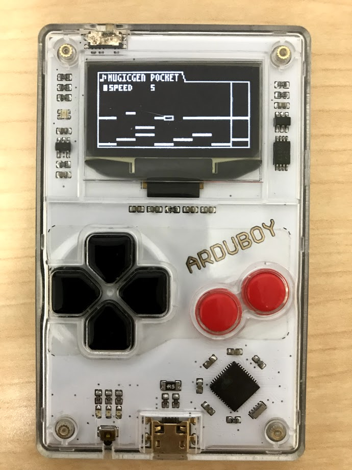

# MUSICGEN POCKET

MUGICGEN POCKET is 8bit mugic generator for Arduboy.

This program generate random but good 8bit chip-tune sequences.

You can listen 8bit music everywhere!

# How to use

- Just turn on & listen!

# Changelog

- Improve graphics
- Pitch-bend

# Screenshot

# Thanks

- https://github.com/filmote/Font4x6
- http://www.andrewlowndes.co.uk/blog/graphics/arduboy-image-converter
